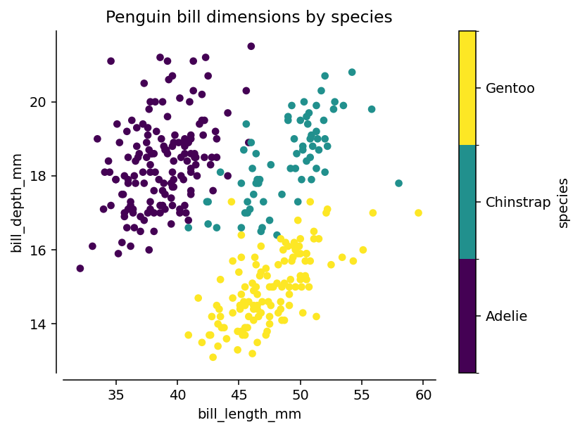
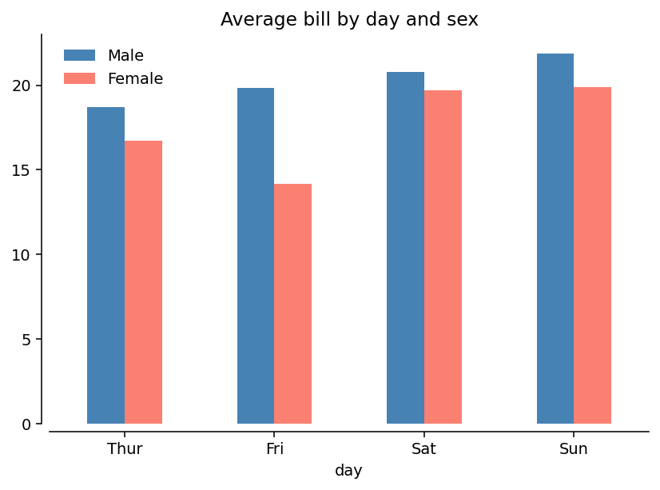
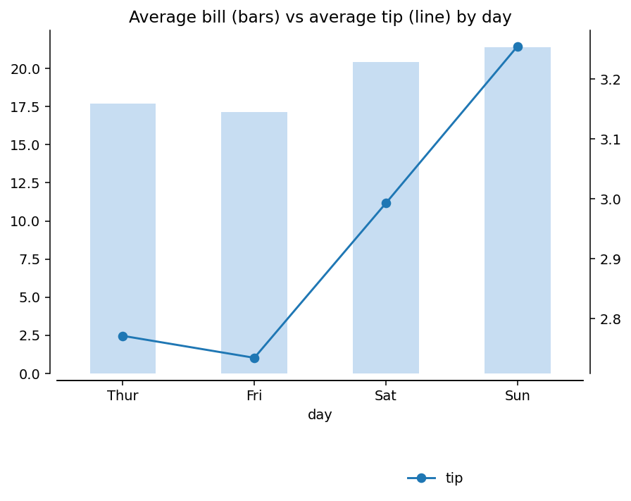
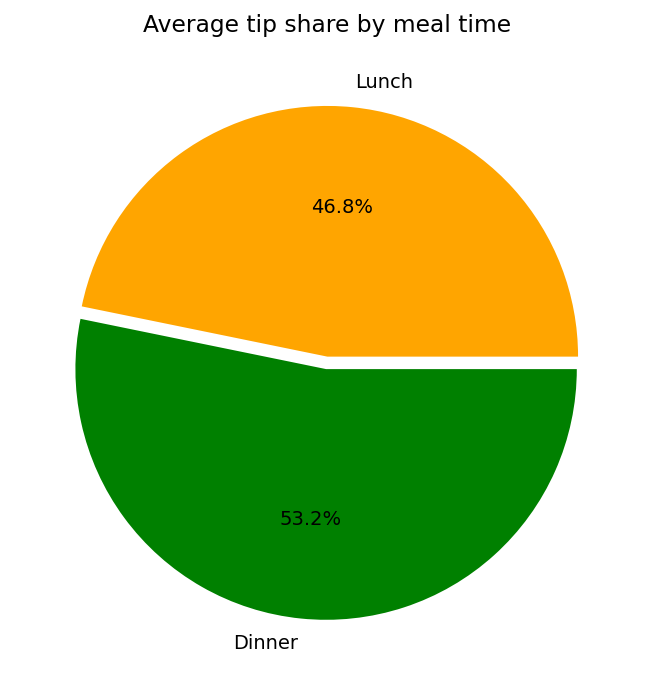
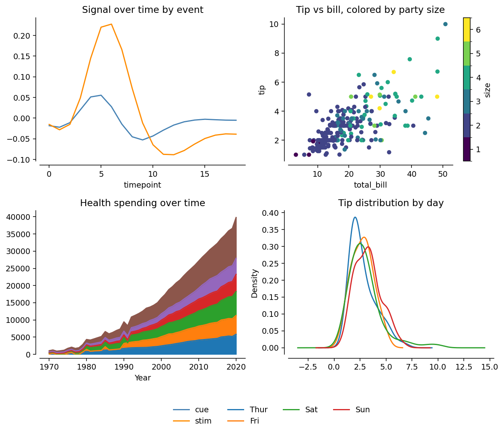
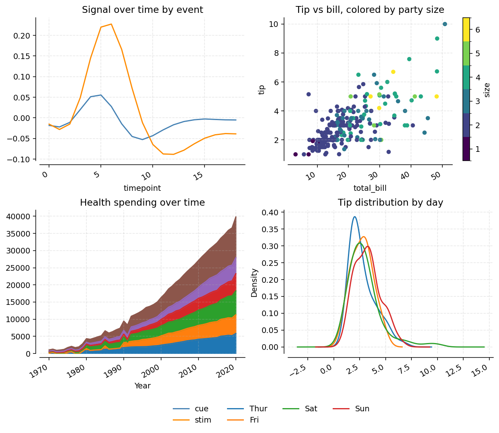

# pytae — Plotting (`Plotter`)

`Plotter` is a method-chainable wrapper around `pandas.plot()` (which itself wraps matplotlib). Chain `.data()` → `.plot()` → `.plot()` → `.finalize()`; each `.plot()` call remembers the previous call's kwargs unless you change `.data()` or the plot `kind`. Requires matplotlib: `pip install pytae[plot]`.

All examples below use pytae's bundled sample datasets (`pytae.sample_data[...]`) — no files to download. See [notebooks/plotter.ipynb](https://github.com/maddytae/pytae/blob/master/notebooks/plotter.ipynb) for the full runnable notebook version, and [docs/LIBRARY.md](LIBRARY.md) for the rest of pytae's library.

## Scatter — colored by category

```python
import pytae as pt

penguins = pt.sample_data["penguins"]

k = pt.Plotter(figsize=(6, 4.5))
(k
 .data(penguins)
 .plot(kind="scatter", x="bill_length_mm", y="bill_depth_mm", c="species", cmap="viridis",
       title="Penguin bill dimensions by species")
 .finalize()
)
k.fig
```



## Grouped bar — aggregated automatically

`by=` splits into groups, `aggfunc=` (default `'sum'`) aggregates — no manual `groupby()`/`pivot()` needed:

```python
tips = pt.sample_data["tips"]
color = {"Male": "steelblue", "Female": "salmon"}

k = pt.Plotter(figsize=(6, 4.5))
(k
 .data(tips)
 .plot(kind="bar", x="day", y="total_bill", by="sex", aggfunc="mean", color=color,
       title="Average bill by day and sex")
 .finalize()
)
k.fig
```



## Secondary axis — two metrics, two scales, one panel

Append `^` to a mosaic key (`on='A^'`) to plot on a secondary y-axis that shares the same x-axis as panel `'A'` — useful when two series live on very different scales (here, dollars vs. tip amount):

```python
tips = pt.sample_data["tips"]

k = pt.Plotter(figsize=(6.5, 4.5))
(k
 .data(tips)
 .plot(kind="bar", x="day", y="total_bill", aggfunc="mean", color="#c7ddf2", legend=False,
       title="Average bill (bars) vs average tip (line) by day")
 .plot(kind="line", x="day", y="tip", aggfunc="mean", on="A^", color="crimson", marker="o")
 .finalize(consolidate_legends=True, ncols=2, bbox_to_anchor=(0.75, -0.05))
)
k.fig
```



The second `.plot()` call reuses `x="day"`/`aggfunc="mean"` from context but targets `on="A^"` instead of `'A'`, so it shares panel `'A'`'s x-axis while getting its own y-scale. Any mosaic panel works this way — `on='B^'`, `on='C^'`, etc. — and `finalize(hide_secondary_y=True)` hides the secondary y-axis's ticks/labels/spine entirely if you only wanted it for scaling, not for display.

```python
tips = pt.sample_data["tips"]
color = {"Lunch": "orange", "Dinner": "green"}

k = pt.Plotter(figsize=(5, 5))
(k
 .data(tips)
 .plot(kind="pie", y="tip", by="time", aggfunc="mean", autopct="%1.1f%%", colors=color,
       explode=(0, 0.05), title="Average tip share by meal time")
 .finalize()
)
k.fig
```



## Multi-panel dashboard — mosaic layout, mixed plot kinds, consolidated legend

Pass a mosaic string to lay out several named axes (`'A'`, `'B'`, …); switch `.data()` between panels and mix plot kinds freely. `finalize(consolidate_legends=True)` merges every panel's legend into one:

```python
fmri = pt.sample_data["fmri"]
tips = pt.sample_data["tips"]
healthexp = pt.sample_data["healthexp"]

color = {"cue": "steelblue", "stim": "darkorange"}

mosaic = """
AB
CD
"""
k = pt.Plotter(mosaic, figsize=(9, 7))
(k
 .data(fmri)
 .plot(x="timepoint", y="signal", by="event", aggfunc="mean", kind="line", color=color,
       on="A", title="Signal over time by event")
 .data(tips)
 .plot(kind="scatter", x="total_bill", y="tip", c="size", cmap="viridis", on="B",
       title="Tip vs bill, colored by party size")
 .data(healthexp)
 .plot(kind="area", x="Year", y="Spending_USD", by="Country", aggfunc="mean", on="C",
       legend=False, title="Health spending over time")
 .data(tips)
 .plot(kind="kde", column="tip", by="day", on="D", title="Tip distribution by day")
 .finalize(consolidate_legends=True, ncols=4, bbox_to_anchor=(0.75, -0.02))
)
k.fig
```



## Enhancing a plot after `finalize()` — looping over axes

`k.axd` is the mosaic-key → `Axes` dict (`k.fig.axes` gives every matplotlib `Axes`, including secondary ones added via `on='X^'`). Once `.finalize()` has run, loop over either to apply the same tweak everywhere — gridlines, tick rotation, reference lines, annotations, anything matplotlib supports directly on an `Axes`:

```python
# ... continuing from the dashboard above, after .finalize()
for ax_key, ax in k.axd.items():
    if "^" in ax_key:       # skip secondary axes if you only want primaries styled
        continue
    ax.grid(True, alpha=0.3, linestyle="--")
    for label in ax.get_xticklabels():
        label.set_rotation(30)
        label.set_ha("right")

k.fig
```



This is the general escape hatch for anything `Plotter` doesn't expose as a kwarg — since `k.fig`/`k.axd` are plain matplotlib objects, nothing about `Plotter` stops you from dropping into regular matplotlib calls afterward (`ax.axhline()`, `ax.annotate()`, `ax.set_ylim()`, …) before the final `k.fig.savefig(...)`.

## Other plot kinds

Everything `pandas.plot()` supports works through `.plot(kind=...)`: `line`, `bar`/`barh`, `area`, `hist`, `kde`/`density`, `scatter`, `hexbin`, `pie`. A few notes:

- `by=`/`aggfunc=` (default `sum`) auto-aggregate for `line`/`bar`/`barh`/`area`/`pie` — pass `aggregate=False` if your data is already one row per `x`/`by` combination.
- `hist`/`kde`/`density` take `column=` (the value column) instead of `y=`.
- `scatter`/`hexbin` don't aggregate; use `c=`/`cmap=` (scatter) or `C=`/`reduce_C_function=` (hexbin) to encode a third variable instead of `by=`.
- `on='A'` targets a specific mosaic panel; `on='A^'` plots on a secondary y-axis sharing panel `'A'`'s x-axis.
- `style=`/`width=` (dicts keyed by series name) set per-line dash style/line width on `line` plots — set once via `.plot()`, not as a matplotlib property afterward.

## `finalize()` options

| Option | Effect |
|---|---|
| `consolidate_legends` | One merged legend across all panels instead of per-panel legends |
| `bbox_to_anchor`, `ncols` | Position/columns for the consolidated legend |
| `legend`, `legend_primary`, `legend_secondary` | Master switch, and per-axis-type switches for primary vs. secondary (`^`) axes |
| `legend_loc`, `legend_frameon` | Location and frame for per-panel legends |
| `hide_secondary_y` | Hide tick labels/spine on secondary (`^`) axes |
